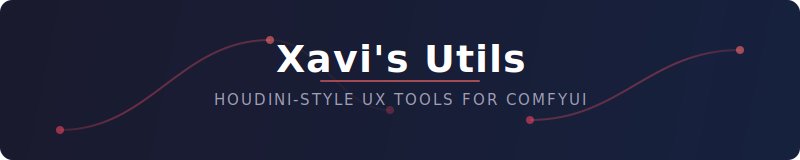

<p align="center">
  
</p>

<p align="center">
  <a href="LICENSE"></a>
  
  
  
</p>

<p align="center">
  Nine independently toggleable features that make ComfyUI's node editor<br/>feel more like a professional DCC tool.
</p>

---

## Features

### Node Inspector

> Hold middle mouse button over any node to see everything at a glance.

<!-- TODO: Add demo GIF — record a short clip showing MMB hover on a node,
     then Ctrl+MMB to pin the panel. Save as assets/demo-inspector.gif -->
<!-- <p align="center"></p> -->

Hover over nodes, inputs, or outputs to see detailed info: types, wire colours, widget values, cook time, VRAM/RAM deltas, image thumbnails, and more. **Ctrl+MMB** pins a persistent panel with action buttons (Copy ID, Center, Jump to Upstream/Downstream).

<details>
<summary>Settings</summary>

| Setting | Default | Range |
|---------|---------|-------|
| Enable | On | On/Off |
| Activation binding | `mmb` | `mmb` / `alt+mmb` / `ctrl+click` |
| Hold delay | 90 ms | 0 -- 500 ms |
| Drift threshold | 100 px | 1 -- 200 px |

</details>

---

### Shake to Disconnect

> Shake a node to rip it out of the graph — wires reconnect automatically.

<!-- TODO: Add demo GIF — shake a node left-right to disconnect it,
     showing the automatic re-wire. Save as assets/demo-shake.gif -->
<!-- <p align="center"></p> -->

Rapidly wiggle a node left-right while dragging to disconnect it. Upstream and downstream nodes are re-wired where types match (IMAGE to IMAGE, MASK to MASK, etc.).

<details>
<summary>Settings</summary>

| Setting | Default | Range |
|---------|---------|-------|
| Enable | On | On/Off |
| Direction reversals | 3 | 2 -- 6 |
| Time window | 400 ms | 200 -- 800 ms |

</details>

---

### Wire Knife

> Hold Y and slash through wires to cut them.

<!-- TODO: Add demo GIF — hold Y, drag across wires to cut.
     Save as assets/demo-knife.gif -->
<!-- <p align="center"></p> -->

Hold **Y** and click-drag to draw a knife line across the canvas. Any wires crossing the line are cut. Works like Houdini's wire-cutting gesture.

<details>
<summary>Settings</summary>

| Setting | Default |
|---------|---------|
| Enable | On |

</details>

---

### Input Rewire

> Drag from a connected input to re-route its wire.

<!-- TODO: Add demo GIF — drag from a connected input to a different output.
     Save as assets/demo-rewire.gif -->
<!-- <p align="center"></p> -->

Click and drag from a **connected** input slot to create a new wire. Drop on a compatible output to replace the old connection. Drop on empty space to keep the original. Makes input and output behaviour symmetrical.

<details>
<summary>Settings</summary>

| Setting | Default |
|---------|---------|
| Enable | On |

</details>

---

### Drop Node on Wire

> Drag a node onto a wire to insert it inline.

<!-- TODO: Add demo GIF — drag a node onto an existing wire to insert it.
     Save as assets/demo-drop.gif -->
<!-- <p align="center"></p> -->

Drag a node onto an existing wire to insert it into the connection. The node must have both a compatible input and output for the wire's type. A glowing highlight shows when insertion is possible.

<details>
<summary>Settings</summary>

| Setting | Default |
|---------|---------|
| Enable | On |

</details>

---

### RMB Zoom

> Right-click drag to zoom — just like Houdini.

<!-- TODO: Add demo GIF — right-click drag up/down on empty canvas to zoom.
     Save as assets/demo-rmb-zoom.gif -->
<!-- <p align="center"></p> -->

Right-click and drag on empty canvas to zoom in (drag up) or out (drag down). Stationary right-clicks still open the context menu. Zoom anchors to the click position.

<details>
<summary>Settings</summary>

| Setting | Default | Range |
|---------|---------|-------|
| Enable | On | On/Off |
| Sensitivity | 5 | 1 -- 20 |

</details>

---

### Tab Search

> Press Tab to search — right where your cursor is.

<!-- TODO: Add demo GIF — press Tab on empty canvas and while dragging a wire.
     Save as assets/demo-tab-search.gif -->
<!-- <p align="center"></p> -->

Press **Tab** to open ComfyUI's node search dialog at the current cursor position. If you're dragging a wire, the search automatically filters to compatible node types. Works like Houdini's Tab menu and Blender's Add Node shortcut.

<details>
<summary>Settings</summary>

| Setting | Default |
|---------|---------|
| Enable | On |

</details>

---

### Dot on Wire

> Double-click a wire to insert a Reroute node.

<!-- TODO: Add demo GIF — double-click on a wire to insert a reroute dot.
     Save as assets/demo-dot-on-wire.gif -->
<!-- <p align="center"></p> -->

Double-click any existing wire to insert a **Reroute** (dot) node at that position. The original connection is split through the reroute. Double-clicks that miss a wire pass through to ComfyUI normally.

<details>
<summary>Settings</summary>

| Setting | Default |
|---------|---------|
| Enable | On |

</details>

---

### Dataflow Highlight

> Hover over a node to see its full dependency chain.

<!-- TODO: Add demo GIF — hover over a node to see upstream (blue) and downstream (orange) highlights.
     Save as assets/demo-dataflow.gif -->
<!-- <p align="center"></p> -->

Hover over any node to highlight its full **upstream** (blue) and **downstream** (orange) dependency chain. Instantly see what feeds into a node and what it feeds. Follows canvas pan/zoom in real time.

<details>
<summary>Settings</summary>

| Setting | Default | Range |
|---------|---------|-------|
| Enable | On | On/Off |
| Hover delay | 200 ms | 0 -- 1000 ms |

</details>

---

## Installation

### Manual

```bash
cd ComfyUI/custom_nodes
git clone https://github.com/xavinitram/ComfyUI-XavisUtils.git
```

Restart ComfyUI. No pip dependencies required.

### ComfyUI Manager

Search for **"Xavi's Utils"** in the Manager's Install Custom Nodes menu.

## Requirements

- ComfyUI with LiteGraph renderer
- Python 3.10+
- No required dependencies beyond ComfyUI's own (`torch` for telemetry, optional `PIL` for thumbnails, optional `psutil` for RAM tracking)

## Documentation

| Document | Description |
|----------|-------------|
| [ARCHITECTURE.md](ARCHITECTURE.md) | How the extension works under the hood |
| [CONTRIBUTING.md](CONTRIBUTING.md) | Guide for adding new features |
| [CHANGELOG.md](CHANGELOG.md) | Version history |

## License

[MIT](LICENSE)
